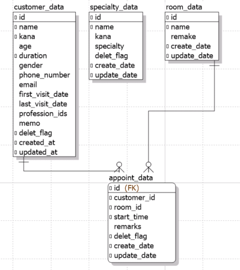

# 外部設計書

## 履歴

|日付|内容|
|:----|:----|
|25/06/25|画面遷移図、HOME画面の仕様|
|25/07/05|テーブル設計|
|25/07/05|機能要件|
|||

## 画面遷移図

```
└── HOME
    ├── カスタマー情報
    │   ├── 一覧
    │   ├── 詳細（編集）
    │   ├── 新規登録
    ├── スケジュール
    │   ├── デイリー
    │   ├── ウィクリー
    │   └── マンスリー
    ├── 専門職情報
    │   ├── 一覧
    │   ├── 詳細（編集）
    │   ├── 新規登録
```

## テーブル設計

### 顧客・患者情報テーブル

- customer_data

|No.|論理名|物理名|データ型|NotNull|デフォルト|備考|
|----:|:---|:---|:---|:---|:---|:---|
|1||id|int(11)auto_increment|Yes(PK)|||
|2||name|varchar(255)|Yes|||
|3||kana|varchar(255)|Yes|||
|4||age|int(11)||||
|5||duration|int(11)|Yes|||
|6||gender|varchar(255)||||
|7||phone_number|varchar(255)||||
|8||email|varchar(255)||||
|9||first_visit_date|datetime||||
|10||last_visit_date|datetime||||
|11||profession_ids|varchar(255)||||
|12||memo|varchar(255)||||
|13||delet_flag|int(11)|Yes|0||
|14||created_at|datetime|Yes|current_timestamp()||
|15||updated_at|datetimeonupdateCURRENT_TIMESTAMP|Yes|current_timestamp()||

### 専門職テーブル

- specialty_data

|No.|論理名|物理名|データ型|NotNull|デフォルト|備考|
|:---|:---|:---|:---|:---|:---|:---|
|1||id|int(11)auto_increment|Yes(PK)|||
|2||name|varchar(255)|Yes|||
|3||kana|varchar(255)||||
|4||specialty|int(11)||||
|5||delet_flag|int(11)||||
|6||create_date|datetime|Yes|current_timestamp()||
|7||update_date|datetimeonupdateCURRENT_TIMESTAMP|Yes|current_timestamp()||

### 診療室テーブル

- room_data

|No.|論理名|物理名|データ型|NotNull|デフォルト|備考|
|:---|:---|:---|:---|:---|:---|:---|
|1||id|int(11)auto_increment|Yes(PK)|||
|2||customer_id|int(11)|Yes|||
|3||room_id|int(11)|Yes|||
|4||start_time|datetime|Yes|||
|5||remarks|varchar(255)||||
|6||delet_flag|int(11)|Yes|0||
|7||create_date|datetime|Yes|current_timestamp()||
|8||update_date|datetimeonupdateCURRENT_TIMESTAMP|Yes|current_timestamp()||

### 予約テーブル

- appoint_data

|No.|論理名|物理名|データ型|NotNull|デフォルト|備考|
|:---|:---|:---|:---|:---|:---|:---|
|1||id|int(11)auto_increment|Yes(PK)|||
|2||name|varchar(255)|Yes|||
|3||remake|varchar(255)||||
|4||create_date|datetime|Yes|current_timestamp()||
|5||update_date|datetimeonupdateCURRENT_TIMESTAMP|Yes|current_timestamp()||


### ER図


## 機能要件
- Python
- FastAPI

### カスタマー情報
- カスタマー情報の一覧表示
- カスタマー情報の詳細表示
  - カスタマー情報の編集
- カスタマー情報の新規登録 

### スケジュール
- スケジュールのデイリー表示
- スケジュールのウィクリー表示
- スケジュールのマンスリー表示
- スケジュールの新規登録
- スケジュールの詳細
  - スケジュールの編集
  - スケジュールの削除

### 専門職情報
- 専門職情報の一覧表示
- 専門職情報の詳細表示
  - 専門職情報の編集
  - 専門職情報の削除
- 専門職情報の新規登録